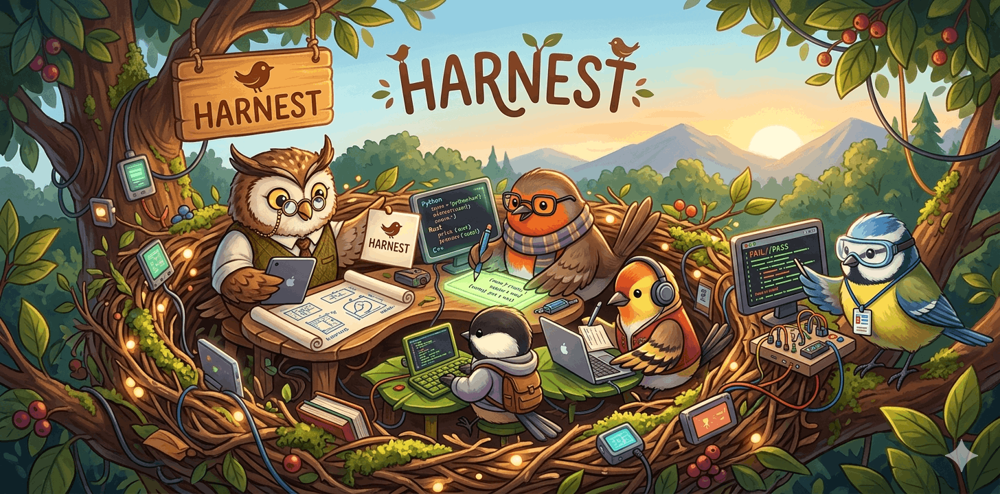

# Harnest

> *Every flock needs a nest. Every nest needs its chicks.*

**Harnest** is a composable agent team harness for [Claude Code](https://docs.anthropic.com/en/docs/claude-code). Drop it into any project to enable structured, multi-agent development workflows — powered by configurable chicks.

## The Language of Harnest

Harnest speaks in birds.

- **The nest** is where your team lives. It's the configuration your project hatches from — a curated set of agent definitions, workflow rules, and supplementary tools. Think of it as the home base that every chick knows.
- **A chick** is a specific nest configuration, like `fullstack`. Chicks define who's on your team, how they work together, and what tools they have access to. Set one globally or pick one per session.
- **Hatch** your project once to scaffold the nest into place. From there, your team wakes up every time you open Claude.

## Commands

| Command | Description |
|---------|-------------|
| `harnest hatch` | Scaffold a chick into the current project |
| `harnest hatch --chick fullstack` | Hatch with a specific chick (one-time) |
| `harnest --chick fullstack` | Set the global default chick |
| `harnest nest` | List available chicks |
| `harnest nest show <name>` | Show chick details (agents, files) |
| `harnest nest export <name>` | Export chick files to a directory |
| `harnest flock [run]` | Run a flock pipeline (interactive) |
| `harnest flock --auto` | Run a flock pipeline autonomously |
| `harnest flock validate` | Validate a flock.yaml file |
| `harnest flock init` | Generate a flock.yaml interactively |
| `harnest flock clean` | Remove temp flock agent files |
| `harnest version` | Print version |
| `harnest help` | Show help |

## Prerequisites

### Required

**Claude Code CLI**

Install via Homebrew (macOS/Linux) or npm:

```bash
# Homebrew
brew install claude-code

# npm
npm install -g @anthropic-ai/claude-code
```

You need an active Anthropic API key or Claude Pro/Team subscription. See [Claude Code docs](https://docs.anthropic.com/en/docs/claude-code) for setup.

**Experimental Teams Flag**

Agent teams require the experimental teams feature. `harnest hatch` configures this automatically in `.claude/settings.json`.

## Quick Start

1. **Install Harnest:**
   ```bash
   brew tap gioperalto/harnest
   brew install harnest
   ```

2. **Hatch in your project:**
   ```bash
   cd your-project
   harnest hatch
   ```
   This scaffolds the default chick (`fullstack`) into your project — copying `harnest.yaml`, agent definitions, and merging Claude Code settings.

3. **Start Claude Code:**
   ```bash
   claude
   ```

4. **Give it a task.** Claude reads the config on startup and bootstraps a Harnest team.

## Chicks

Harnest ships with pre-built team configurations called chicks. Each chick defines a set of agent roles, workflow rules, and supplementary tools tailored for a specific development style.

**Set a global default chick:**
```bash
harnest --chick fullstack
```

**List available chicks:**
```bash
harnest nest
```

**Show chick details:**
```bash
harnest nest show fullstack
```

**Export a chick to inspect or customize:**
```bash
harnest nest export fullstack --dir ./my-fullstack
```

**Hatch with a specific chick (one-time override):**
```bash
harnest hatch --chick fullstack
```

The global default is stored in `~/.config/harnest/config` and used by `harnest hatch` when no `--chick` flag is given.

## Available Chicks

Chicks are organized into **public** (user-facing project workflows) and **internal** (harnest development and meta-tooling).

### Public

| Chick | Description |
|-------|-------------|
| [`fullstack`](nest/public/fullstack/) | Architect + Sr Engineer + Jr Engineers + Test Engineer. Plan → implement → review → test workflow. |
| [`webpage`](nest/public/webpage/) | Strategist + Artist + Builder + UX Tester. Interview → generate assets → build → validate workflow for single-page React Vite TypeScript websites. |
| [`webgame`](nest/public/webgame/) | Game Designer + Builder + Playtester. Design → build → playtest workflow for web games. |
| [`chick`](nest/public/chick/) | Researcher + Synthesizer + Builder + Reviewer. Research a concept → interview user → scaffold a new chick → review for conventions. Meta chick that creates new chicks. |
| [`brainstorm`](nest/public/brainstorm/) | Facilitator + Explorer + Provocateur (Gemini) + Synthesizer. Frame a challenge → generate ideas in parallel (structured + unconventional) → synthesize into actionable output. Requires [claude-code-router](https://github.com/musistudio/claude-code-router). |

### Internal

| Chick | Description |
|-------|-------------|
| [`canary`](nest/internal/canary/) | Validator + Observer. Dogfood other chicks end-to-end — validate setup, workflow execution, and clean termination with Claude Code OTel observability. Supports local Jaeger or Datadog. |
| [`flock`](nest/internal/flock/) | Interviewer + Composer. Meta chick for generating flock.yaml pipeline definitions interactively. |
| [`improver`](nest/internal/improver/) | Assessor + Implementer + Validator + Shipper. Assess, improve, validate, and ship enhancements to existing chicks. |

See the [nest/](nest/) directory for full documentation on each chick.

## How Chick Data is Bundled

Harnest embeds all chick definitions in a single `lib/nest-registry.json` file, generated at release time by `scripts/pack-nest.sh`. This means:

- **No repo clone required.** Homebrew users get all chick data bundled in the install — `harnest hatch`, `harnest nest`, and `harnest flock` work without the source repository on disk.
- **No network required.** All chick data is local. There are no GitHub fetches or remote dependencies at runtime.
- **Local dev works too.** If a `nest/` directory exists (i.e., you cloned the repo), harnest uses it directly. The registry is a fallback for production installs where `nest/` is absent.

Resolution order: `nest/` directory (filesystem) > `lib/nest-registry.json` (embedded registry).

**Rebuilding the registry** (contributors only):
```bash
./scripts/pack-nest.sh
```
This serializes the entire `nest/` tree into `lib/nest-registry.json`. The Homebrew formula runs this automatically during build.

## Flock — Multi-Chick Pipelines

A flock chains multiple chicks into a sequential pipeline — like Docker Compose, but for AI workflows. Define the pipeline in a `flock.yaml` file and run it with a single command.

**Create a pipeline interactively:**
```bash
harnest flock init
```
This hatches the [`flock`](nest/flock/) meta-chick and launches a Claude session that interviews you about your workflow and generates a `flock.yaml`.

**Example `flock.yaml`:**
```yaml
chicks:
  research:
    chick: brainstorm
    prompt: "Explore approaches to real-time data sync"

  build:
    chick: fullstack
    prompt: "Implement the chosen sync approach"
    depends_on:
      - research

settings:
  continue_on_failure: false
  timeout: 30
```

**Run the pipeline:**
```bash
# Interactive mode — confirm each step
harnest flock run

# Autonomous mode — runs all steps without prompts
harnest flock --auto

# Use a custom pipeline file
harnest flock run --file pipelines/my-flock.yaml
```

**Validate without running:**
```bash
harnest flock validate
```

**Clean up temp files after a run:**
```bash
harnest flock clean
```

Flock creates namespaced agent files (e.g., `flock-research-explorer.md`) in `.claude/agents/` and a conductor agent that orchestrates the pipeline. These are cleaned up automatically when a run ends, or manually with `flock clean`. Your `flock.yaml` and chick outputs are preserved.

## Contributing

See [CONTRIBUTING.md](CONTRIBUTING.md) for guidelines on contributing to Harnest, including how to create new chicks.

## License

MIT
